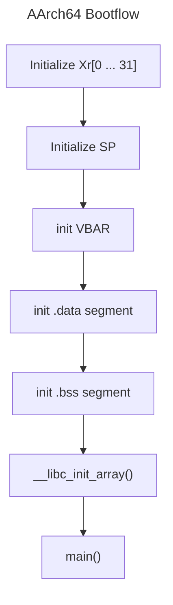
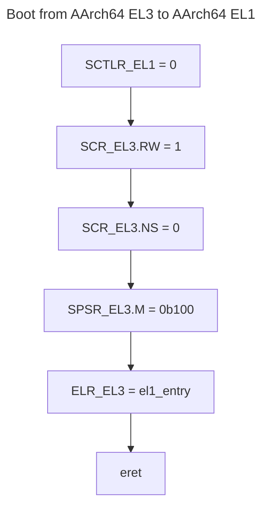
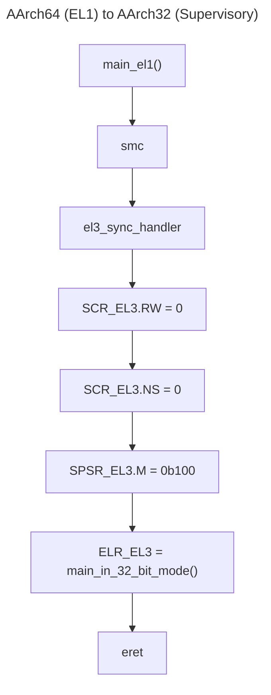

# AArch64 Bootflow Demystified and Simplified

## References
- [Arm® Architecture Reference Manual Armv8, for Armv8-A architecture profile](https://developer.arm.com/docs/ddi0487/ea/arm-architecture-reference-manual-armv8-for-armv8-a-architecture-profile)
- [ARM Cortex-A Series Programmer’s Guide for ARMv8-A](https://developer.arm.com/docs/den0024/a/preface)
- [Bare-metal Boot Code for ARMv8-A Processors](https://developer.arm.com/docs/dai0527/a/bare-metal-boot-code-for-armv8-a-processors)
- [Arm® Power State Coordination Interface - Platform Design Document](https://developer.arm.com/docs/den0022/d/arm-power-state-coordination-interface-platform-design-document)
- [aarch64 exception levels](https://krinkinmu.github.io/2021/01/04/aarch64-exception-levels.html)
# Aarch64 Bootflow

Compared to **AArch32**, in **AArch64** reset vector is not part of the exception vector table. The starting address of execution and the exception level at start of execution is *Implementation Defined*. The common boot flow is to:
1. Set the vector table (VBAR)
2. Route exceptions and set the correct masks configurations


Here is a very simple startup assembly code
``` asm
_reset:
  mov x0, xzr
  mov x1, xzr
  // .... do for all until x30
	
  // get the cpu id via MIPDR_EL1, Multiprocessor Affinity Registers
  // the MPIDR provides processor identification
  // See AArch64 Reference Manual, D13.2.99 MIPDR_EL1
  mrs x1, MPIDR_EL1
  // the lsb bytes contains the cpu id
  and x1, x1, 0xFF
  // initialise stack ptr depending on the processor
  cmp x1, 0
  beq _init_cpu0

_init_cpu0:
  // ... the ldr instruction below is a "pseudo instruction" it
  // tells to load the `__stack_top_el3` address we defined in the linker
  // script into register x0. This is equivalen to
  //
  //    extern char *__stack_top_el3;
  //    x0 = &(__stack_top_el3);
  //
  // ... ok, to clarify even further, when code access symbols defined
  // in the linker script, the value of the symbol is treated as address
  // think of it as `__stack_top_el3` is a var but the address of the
  // var contains the value you assigned to the symbol `__stack_top_el3` in
  // linker script.
  ldr x0, =__stack_top_el3

  //  Now the x0 holds the address value defined by linker symbol
  //  stack_top. set the value of the stack pointer to x30
  //
  //  TODO: each cpu must have its own stack pointer starting
  //  address, for now we only use cpu0
  mov sp, x0

_el3_init:
  // load el3_vtable mem address to register x1
  ldr x1, =_exc_vector_table

  // assign x1 (address of el3_vtable) to EL3 Vector Table
  // Base Address Register (VBAR)
  msr VBAR_EL3, x1

// this initialise all data from its loadable address in ROM
// to the virtual address in RAM
_data_load:
  ldr x10, =__data_load_start__
  ldr x11, =__data_start__
  ldr x12, =__data_end__
_data_copy_loop:
  // set data_ram[idx] = data_load[idx]
  ldr x13, [x10]
  str x13, [x11]
  // is &bss[idx] == &bss[end_idx]
  // this compare memory address NOT VALUE
  cmp x11, x12
  // if greater or equal, go to end
  bge _data_copy_end
  // else address(aka idx) increment
  // note that we copy by u64, so make sure that the section
  // alignment in the linker script is aligned by 8, otherwise
  // we might hit beyond the end of the section boundary
  add x11, x11, #8
  add x10, x10, #8
  // keep copying data segment
  b _data_copy_loop
_data_copy_end:

// This clears the .bss segment, all uninitialized static variables
// will be cleared to zero. Note that since we are running at 64-bit
// mode, make sure that in linker script, bss must be 8-byte aligned.
//
// in case that bss is 4-byte aligned, use `w` prefix for register
// instead of `x` to indicate that register operation is in `word`
// size (32-bit) i.e `str wzr, [w28]`
_bss_clear:
  ldr x28, =__bss_start__
  ldr x29, =__bss_end__
_bss_loop:
  // set bss[idx]=0
  str xzr, [x28]
  // is &bss[idx] == &bss[end_idx]
  cmp x28, x29
  // if greater or equal, go to end
  bge _bss_end
  // else address(aka idx) increment
  add x28, x28, #4
  // keep clearing bss mem
  b _bss_loop

_bss_end:
  // call the libc (C Runtime) initialization routines
  bl __libc_init_array
  // jump to main
  bl main
  b .
```

# Changing Execution Level
Usually,  only Trusted Firmware should run in **EL3** (Secure Monitor), kernel code or baremetal code must run at **EL1** (Kernel or Privileged Mode). It must be in **EL1** since access to peripherals requires CPU to be in privileged mode.

## Higher EL to Lower EL
Going from higher EL to lower EL can be done via `eret` instruction, but certain instructions must first be executed.


The relevant register here are (assume we start at EL3)
1. To initialize the System Control Register of the target EL, in this case SCTLR_**EL1**
2. Set the *execution state* of the target EL via SCR_EL3.RW,bit\[10\]. Setting it to `0b0`, the target lower EL will execute at AArch32, setting it to `0b1`, the target lower EL will execute at AArch64.
3. Set the SCR_EL3 (Secure Configuraton Register) which **sets the secure state and execution state of the target lower EL** via `SCR_EL3.RW bit[10]`. Setting it to `0b0` indicates EL0 and EL1 will execute at secure state, setting it to `0b1` indicates all EL lower than EL3 will be in *non-secure state*, secure memory will be inaccessible. **In our case, this is baremetal  program, we want EL1 to be able to access secured memory**.
4. Set the SPSR_EL3 (Saved Program Status Register) `M[3:0]` bits to the targeted EL. In this case we will set the `M[3:0]` to `0b0100`, or EL1*h* (Exception Level at Handler Mode).
5. Execute instruction `eret` (Exception Return), the PSTATE (Processor State) is restored from SPSR and *branch to* the address held in the *ELR*. Since the SPSR is set to EL1*h*, when PSTATE is restored from SPSR, processro once branced to ELR, will not be in EL1*h*.

### SPSR (Saved Program Status Register )
`SPSR_ELn`, that holds process state on taking an exception in `ELn`. In the example above, when `eret` is executed, the `SPSR_ELn` will be used to restore the `PSTATE` (where _n_ is the current EL, in the example above, EL3).  

Also note that the SPSR bit-fields depends on the execution state (AArch64 or AArch 32).  When changing exception level or execution state, it is very important to write the correct target mode. Below are `SPSR.M[4:0]` values.

| Value  | Mode (AArch64) | Mode (AArch32) |
| ------ | -------------- | -------------- |
| 0b0000 | EL0**t**       | User           |
| 0b0001 |                | FIQ            |
| 0b0010 |                | IRQ            |
| 0b0011 |                | Supervisor     |
| 0b0100 | EL1**t**       |                |
| 0b0101 | EL1**h**       |                |
| 0b0111 |                | Abort          |
| 0b1000 | EL2**t**       |                |
| 0b1001 | EL2**h**       |                |
| 0b1011 | EL0**t**       | Undefined      |
| 0b1100 | EL3**t**       |                |
| 0b1101 | EL3**h**       |                |
| 0b1111 |                | System         |


> [!NOTE] Exception Return (`eret`)
> You might wonder why `eret`, executing `eret` will always cause `PSTATE` to be restored from `SPSR` and branch to the address held by `ELR`. 
> 
> Also do note that `PSTATE` is NON-WRITABLE, software cannot write to PSTATE and even if it can, its not good since program should not be changing processor state at runtime. So the best way to change `PSTATE` is to call `eret`.

Here is an example boot code
```asm

#define SCTLR_RW_64_BIT          (1 << 10)
#define SCTLR_NS_NON_SECURE_MODE (1 << 0)
#define SCTLR_HCE_ENABLE         (1 << 7)

_el3_boot_to_el1:
	msr sctlr_el1, xzr
	mrs x0, scr_el3
	orr x0, x0, #SCTLR_RW_64_BIT
	orr x0, x0, #SCTLR_NS_NON_SECURE_MODE
	and x0, x0, #~SCTLR_HCE_ENABLE
	mrs scr_el3, x0
	mrs x0, spsr_el3
	orr x0, x0, #0b0100
	msr spsr_el3, x0
	adr x0, _el1_entry
	msr elr_el3, x0
	eret
	
_el1_entry:
	/* initialise at el1 mode */
```
## Lower EL to Higher EL
But going from lower EL to higher EL requires generating synchronous exception. To generate this exception requires calling different assembly instructions:
* `svc` : *supervisory call*, lower exception to EL1 
* `hvc` : *hypervisor call*, lower exception to EL2 (if implemented)
* `smc` : *securemonitor call*, lower exception to EL3 (if implemented)

Suppose we are now in `EL1` but we want to go to `EL3`, in this case the flow would be
1. Execute `smc`
2. Synchronous Exception handler (current EL with SPx) will be executed
3. Once in Synchronous Exception handler, `PSTATE.EL` will not be in `EL3`

Here is an example code
```asm
_el1_code:
	smc #0 // el1 code calls smc

.balign 0x800 // aarch64 vector table requires 2KiB align
_el3_vtable:
	b el3_sync_handler

el3_sync_handler:
	save_register_to_stack
	bl el3_c_code_sync_handler
	restore_register_to_stack
	eret
```

## Debugging Tips
### How to determine current exception level
To determine the current EL, the system register `currentEL` must be read. The only way to do that is to use `MRS` instruction, store it into register and read it. With GDB we could an an MRS instruction.
```asm
_spx_sync_handler:
  saveregister
  mrs x12, currentEL
  bl el_spx_sync_handler
  restoreregister
  eret
```
Then before branching to the C-function handler, add a breakpoint
``` bash
(gdb) b el_spx_sync_handler
```
then read `x12` register
``` bash
(gdb) info registers x12
```

# Changing Execution State (AArch64 to AArch32)
There are cases when an application has to run in 32-bit mode, this would require the processor to change the execution state from 64-bit to 32-bit. To change the execution state follows almost similar flow from above (boot from EL3 to EL1).

If the 64-bit program is currently running at `EL1`, it must
1. Move to a higher `EL` in this case `EL3` via `smc` call
2. Once in EL3, program the `SCR_ELn.RW` bit to `0` indicating that `EL` lower than the current `ELn` will execute at 32-bit mode.
3. Set the `SPSR_ELn.M` to the target mode, in this case since we want to execute to `supervisory` mode,  set it to `0b0011`.
4. Set the `ELR_ELn` exception link register to the address of the 32-bit code.
5. Call `eret` at this point, processor will branch and link to address in the `ELR_ELn`, restore `PSTATE` from `SPSR_ELn`, and execute in execution mode set in `SCR_ELn`.



