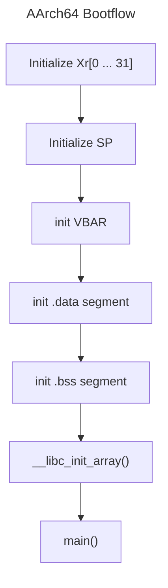
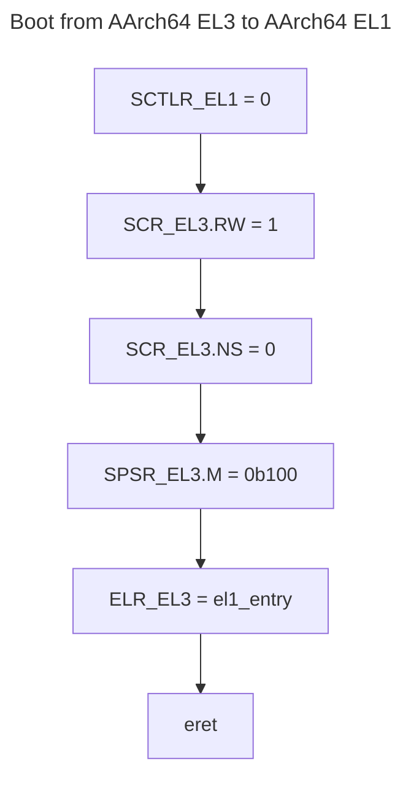

# AArch64 Bootflow

Compared to **AArch32**, in **AArch64** reset vector is not part of the exception vector table. The starting address of execution and the exception level at start of execution is *Implementation Defined*. The common boot flow is to:
1. Set the vector table (VBAR)
2. Route exceptions and set the correct masks configurations

> [!NOTE] Source
> DAI0527A Baremetal Bootcode ARMv8


# Changing Execution Level
Usually,  only Trusted Firmware should run in **EL3** (Secure Monitor), kernel code or baremetal code must run at **EL1** (Kernel or Privileged Mode). It must be in **EL1** since access to peripherals requires CPU to be in privileged mode.

## Higher EL to Lower EL
Going from higher EL to lower EL can be done via `eret` instruction, but certain instructions must first be executed.


The relevant register here are (assume we start at EL3)
1. To initialize the System Control Register of the target EL, in this case SCTLR_**EL1**
2. Set the *execution state* of the target EL via SCR_EL3.RW,bit\[10\]. Setting it to `0b0`, the target lower EL will execute at AArch32, setting it to `0b1`, the target lower EL will execute at AArch64.
3. Set the SCR_EL3 (Secure Configuraton Register) which sets the *secure state* of the target **lower** EL via `SCR_EL3.RW bit[10]`. Setting it to `0b0` indicates EL0 and EL1 will execute at secure state, setting it to `0b1` indicates all EL lower than EL3 will be in *non-secure state*, secure memory will be inaccessible. **In our case, this is baremetal  program, we want EL1 to be able to access secured memory**.
4. Set the SPSR_EL3 (Saved Program Status Register) `M[3:0]` bits to the targeted EL. In this case we will set the `M[3:0]` to `0b0100`, or EL1*h* (Exception Level at Handler Mode).
5. Execute instruction `eret` (Exception Return), the PSTATE (Processor State) is restored from SPSR and *branch to* the address held in the *ELR*. Since the SPSR is set to EL1*h*, when PSTATE is restored from SPSR, processro once branced to ELR, will not be in EL1*h*.

> [!NOTE] SPSR
> SPSR_EL*n*, that holds process state on taking an exception in EL*n*. In the example above, when `eret` is executed, the SPSR_EL*n* will be used to restore the PSTATE (where *n* is the current EL, in the example above, EL*3*).

> [!NOTE] Exception Return
> You might wonder why `eret`, but when CPU boots, its not in *exception state*. Normally `eret` is used to return from an exception back to the normal routine state before an exception happen. In this case, regardless if CPU is in exception state or not, it doesnt matter, `eret` will always cause PSTATE to be restored from SPSR and branch to the address held by `ELR`.
> 
> Another thing is PSTATE is NON-WRITABLE, software cannot write to PSTATE. So the only way to change PSTATE is to call `eret`. 

Here is an example boot code
```asm
_el3_boot_to_el1:
	msr sctlr_el1, xzr
	mrs x0, scr_el3
	orr x0, x0, (1 << 10)
	orr x0, x0, (0 << 0)
	mrs scr_el3, x0
	mrs x0, spsr_el3
	orr x0, x0, #0b0100
	msr spsr_el3, x0
	adr x0, _el1_entry
	msr elr_el3, x0
	eret
	
_el1_entry:
	/* initialise at el1 mode */
```
## Lower EL to Higher EL
But going from lower EL to higher EL requires generating synchronous exception. To generate this exception requires calling different assembly instructions:
* `svc` : *supervisory call*, lower exception to EL1 
* `hvc` : *hypervisor call*, lower exception to EL2 (if implemented)
* `smc` : *securemonitor call*, lower exception to EL3 (if implemented)

Suppose we are now in `EL1` but we want to go to `EL3`, in this case the flow would be
1. Execute `smc`
2. Synchronous Exception handler (current EL with SPx) will be executed
3. Once in Synchronous Exception handler, `PSTATE.EL` will not be in `EL3`

Here is an example code
```asm
_el1_code:
	smc #0 // el1 code calls smc

.balign 0x800 // aarch64 vector table requires 2KiB align
_el3_vtable:
	b el3_sync_handler

el3_sync_handler:
	save_register_to_stack
	bl el3_c_code_sync_handler
	restore_register_to_stack
	eret
```
