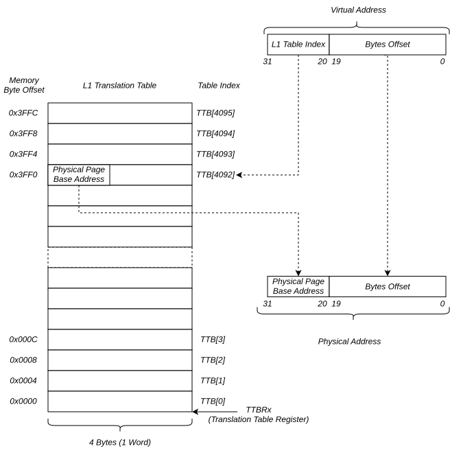
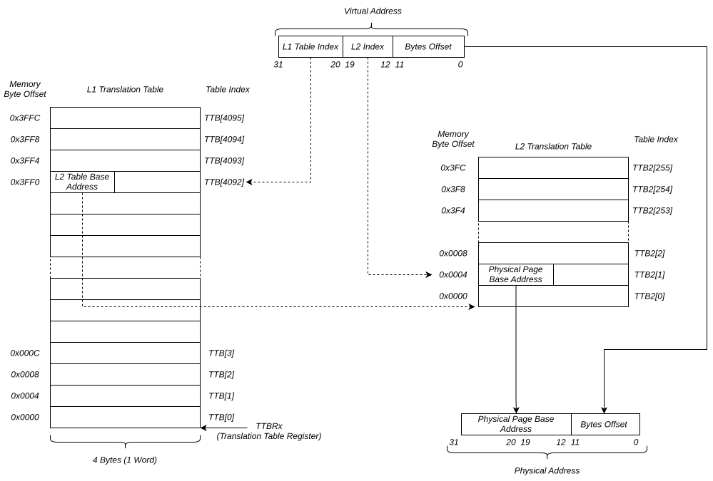
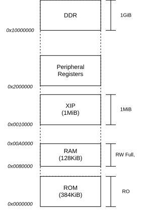

# ARM Cache
------
## Cache Terms
* `cache` memory that holds commonly or most recently used memory data.
* `cache block` group of words that is a unit of storage, also known as `cache line`.
* `b` *block size* size of a cache block.
* `C` *capacity* the number of data words that cache can hold.
* `B` which is `= C/b` is the number of cache blocks.
* `S` *sets*, cache is organized in terms of sets.
* `A` *Associativity*, is the degree of associativity of a *set associative cache*. 

## Direct Map Cache
In a *direct map* cache, each *Set*(`S`) has exactly one *Block*(`B`), `S=B`, which means in direct map cache, the **number of sets `S` is equal to the number of blocks `B`**. Lets create an example:


The `set` bits indicates the index of the cache line the data will be stored to. The most significant bit, the`tag` bits indicates the address in memory the data is located in. The `tag` and `set` associates cache data to the actual memory location data is stored into.


The problem with direct map cache is two or more `tag` could be associated into a single cache line. This is called *cache conflict*. Consider this code:
```C
int *a = 0x40;
int *b = 0x80;
int *c = 0xC0;
int size = 10;

while(size--)
  *c = *a++ + *b++;
```
if `0x40`, `0x80`, `0xC0` maps to the same set, both read and write access will repeatedly cause a cache miss. Every access will cause cache to be replaced. This problem is called *cache thrashing*.

## Cache Associativity
In a *set associative cache*, each set `S` would contain `B/A` blocks where `A` is the degree of associativity. An `A=2` means a cache with `B=8` would contains `B/A = 8/2 = 4` number of *sets* `S`.


**ARM always uses *set associative cache***. The `CCSIDR`(Cache Size ID Registers) provide information to cache.

```text
  31   30   29   28  27                    13 12             3 2          0
+----+----+----+----+------------------------+----------------+------------+
| WT | WB | RA | WA |         NumSets        |  Associativity |  LineSize  |
+----+----+----+----+------------------------+----------------+------------+
```
Fields Descriptions are:
  * `LineSize, bits[2:0]` is Log2(N) - 4, where *N=Number of Cache Line Bytes*.
  * `Associativity, bits[12:3]` *=Associative(`A`)-1* Is the degree of associativity for a *set associative* cache.
  * `NumSets, bits[27:13]` *=Number of Sets(`NSETS`)-1* The number of sets in the cache.
  * `WT, bit [31]` Indicates whether the cache level supports write-through.
  * `WB, bit [30]` Indicates whether the cache level supports write-back.
  * `RA, bit [29]` Indicates whether the cache level supports read-allocation.
  * `WA, bit [28]` Indicates whether the cache level supports write-allocation.

Example assembly code:
```asm
  mrc p15, 1, r1, c0, c0, 0 ; r1 = CCSIDR
  ldr r2, =0x07
  and r2, r2, r1            ; r2 = CCSIDR.LineSize
  ldr r3, =0x3FF
  and r3, r3, r1            ; r3 = CCSIDR.Associativity
  ldr r4, =0x7FFF
  and r4, r4, r1            ; r4 = CCSIDR.NumSets
```

Example C code:
```C
#define mrc(cp, opc1, val, crn, crm, opc2) \
	do { \
		uint32_t _val; \
		__asm__ volatile("mrc p" #cp ", " #opc1 ", %0, c" #crn ", c" #crm ", " #opc2 \
				 : "=r"(_val) \
				 : \
				 : "memory"); \
		(val) = _val; \
	} while (0)

uint32_t ccsidr = mrc(15, 1, 0 ,0, 0);
```


## Cache Policy

## Write Cache Policy
  * `write-through`: When data is written to cache, it is immediately written to memory. This keeps the cache and main memory sync but at the cost of increase in main memory traffic due to write transactions.
  * `write-back`: Writes are only performed in cache. This could cause data in memory to be **stale**. When cache is written , a **dirty** bit in cache is set to `1` to indicate that data is written in cache but not yet in main memory.

## Allocation Policy
  * *read-allocatation* policy indicates that at cache miss at *read*, *cacheline* will be filled by copying data from main memory, but cache miss at *write* will not fill the *cacheline*.
  * *write-allocatation* policy indicates that at cache miss at both *write* and *read*, *cacheline* will be filled by copying data from main memory. Note that this must be in combination with *write-back* policy, wherein the data written to a cache block is simultaneously written to main memory.

## Clean and Invalidation
  * `invalidation` refers to cache line **valid** bit to be set to `0`. If its valid, then invalidate!
  * `clean` refers to write contents of all cache lines with **dirty** bits set to main memory.

## PIPT and VIPT

> [!Note] ARM core main cache (L1) always use N-way set associative cache. 
> ``` text 
> Associative cache address format:
>  +----------------+--------+---------+----------+
>  |     Tag        |   Set  |   Word  |   Byte   |
>  +----------------+--------+---------+----------+
> 31              13 12     5 4       2 1         0
> ```

**Virtual Index Physical Tag**, means that *virtual address is used to determine the cache line index* but the *physical address is used for tag*. This resolves the issue of cache need for invalidation when MMU virtual to physical mapping changes. However this introduces new problem, since the associative cache uses bit [12:5] to determine the `set`, virtual address uses bit [12] for address translation (64KiB page size). This potentially creates a problem, two or more virtual address with different bit [13:12] could also point to the same physical address. This creates two or more cache entries that points to the same physical address, which means memory can already exist in the cache line with different virtual cache line index.
```text
                                  Virtual Address
 +----------------+-----------------------------+
 |      Index     |           offset            |
 +----------------+-----------------------------+
31       |      12 11          |                0
         v                     |
 +----------------+            |
 |   Translation  |            |
 +----------------+            |
         |                     |
         v                     v  Physical Address
 +----------------+-----------------------------+
 |      Index     |           offset            |
 +----------------+-----------------------------+
31              12 11                           0
```
The solution to this is to use [page colouring](https://developer.arm.com/community/arm-community-blogs/b/architectures-and-processors-blog/posts/page-colouring-on-armv6-and-a-bit-on-armv7) scheme. Page colouring uses `bits[13:12]` to indicate a colour. A page allocator, when mapping virtual address to a physical address, will impose restriction, to ensure that a physical address will only be mapped to a single colour. physical address will be use both as cache line index and cache tag. This ensures that there would be no duplicate physical address tag in cache.

All ARM cortex uses `PIPT` scheme for data cache and `VIPT` for instruction cache since usually, restriction in size can be imposed in instructions, which prevents wrapping of `bits[13:12]` which prevents having two virtual address being mapped to the same physical address.


# Memory Management Unit
----
ARM AArch32 has two Memory Systems Architecture: VMSA and PMSA. **PMSA** or Protected Memory System Architecture is a memory protection architecture scheme that utilizes **MPU**, while **VMSA** or Virtual Memory System Architecture provides both memory protection and address virtualization via **MMU**. Think of **MMU** as an **MPU** but with added virtualization.

The Memory Model Feature Register 0 (ID_MMFR0 bits[3:0] VMSA/PMSA support) allows program to identify if the core (i.e Cortex A-53) supports **PMSA** or **VMSA**.
``` asm
  MRC p15, 0, r0, c0, c1, 4
```

## Memory Management Unit (MMU)
The MMU provides both address virtualization and memory protection. It translates CPU memory access from virtual address to physical address which allows writing programs without knowing the underlying physical memory organization. In Baremetal application, MMU can be used to partition memory map and assign protection attributes such as permission and memory attributes such as regions being cache-able or executable.

The ARM MMU uses 2 levels of translation. The 1st level of translation splits the entire AArch32 memory space (2^32 or **4GiB**) into **4096 sections**, each is **1MiB** (4GiB / 4096) in size. A **section** is a unit of translatable memory space.

### L1 Translation
When CPU wants to access memory with a virtual address, the MMU will look into the L1 Translation Table to translate virtual to physical address. The L1 Translation table, aka 'page table' is an array of words(u32) with length of **4096**, with each entry holds either pointer to the base address of L2 Translation table or the *mapped physical address* and protection/memory attributes for translating and accessing a **1MiB** section.



> [!Note] Pages and Page Table
> **Page**: Refers to the unit of translation i.e a 1MiB *virtual* page will be translated to the same *physical* page size.
> **Page Table**: Is a table that is used to translate virtual to physical. Typically each element is word size and can be address via virtual address and each element contains the physical page address.

## L2 Translation

L2 Translation provides coarse address translation at the expense of additional table.


## PIPT and VIPT

> [!Note] ARM core main cache (L1) always use N-way set associative cache. 
> ``` text 
> Associative cache address format:
>  +----------------+--------+---------+----------+
>  |     Tag        |   Set  |   Word  |   Byte   |
>  +----------------+--------+---------+----------+
> 31              13 12     5 4       2 1         0
> ```

**Virtual Index Physical Tag**, means that *virtual address is used to determine the cache line index* but the *physical address is used for tag*. This resolves the issue of cache need for invalidation when MMU virtual to physical mapping changes. However this introduces new problem, since the associative cache uses bit [12:5] to determine the `set`, virtual address uses bit [12] for address translation (64KiB page size). This potentially creates a problem, two or more virtual address with different bit [13:12] could also point to the same physical address. This creates two or more cache entries that points to the same physical address, which means memory can already exist in the cache line with different virtual cache line index.
```text
                                  Virtual Address
 +----------------+-----------------------------+
 |      Index     |           offset            |
 +----------------+-----------------------------+
31       |      12 11          |                0
         v                     |
 +----------------+            |
 |   Translation  |            |
 +----------------+            |
         |                     |
         v                     v  Physical Address
 +----------------+-----------------------------+
 |      Index     |           offset            |
 +----------------+-----------------------------+
31              12 11                           0
```
The solution to this is to use [page colouring](https://developer.arm.com/community/arm-community-blogs/b/architectures-and-processors-blog/posts/page-colouring-on-armv6-and-a-bit-on-armv7) scheme. Page colouring uses `bits[13:12]` to indicate a colour. A page allocator, when mapping virtual address to a physical address, will impose restriction, to ensure that a physical address will only be mapped to a single colour. physical address will be use both as cache line index and cache tag. This ensures that there would be no duplicate physical address tag in cache.

All ARM cortex uses `PIPT` scheme for data cache and `VIPT` for instruction cache since usually, restriction in size can be imposed in instructions, which prevents wrapping of `bits[13:12]` which prevents having two virtual address being mapped to the same physical address.

# Initialising MMU Bootflow
On the high level part of the bootflow is to
  1. clear and/or invalidate all caches: *I-Cache*, *D-Cache*, *TLB*
  2. create a translation table
  3. initialise the Translation Table Register (`TTBR`)
  4. enable caches
  5. enable MMU

## Invalidating Caches

The first step is to make sure the caches are all invalidated. At power-up (cold boot) this might not matter as we expect caches are disabled and invalidate but at runtime reset, caches might be dirty. Part of boot process is to invalidate the I-Cache, D-Cache and TLB.

Example code invalidating icache
```asm
setup_cache:
  /* disable mmu and all caches */
  mrc p15, 0, r1, c1, c0, 0
  bic r1, r1, #1
  bic r1, r1, #(1 << 12)
  bic r1, r1, #(1 << 2)
  mcr p15, 0, r1, c1, c0, 0

  /* invalidate all caches and TLB */
  mov	r0, #0
  mcr	p15, 0, r0, c7, c5, 0		// invalidate instruction cache
  mcr	p15, 0, r0, c7, c5, 6		// Invalidate branch predictor array
  mcr	p15, 0, r0, c8, c7, 0		// invalidate entire unified TLB
  isb
  bl invalidate_dcache

  /* enable all caches */
  mrc p15, 0, r1, c1, c0, 0
  bic r1, r1, #(1 << 12)
  bic r1, r1, #(1 << 2)
  mcr p15, 0, r1, c1, c0, 0
```

# Invalidating the Data Cache
The coprocessor 15(`cp15`) operation `DCISW` is used to invalidate the data cache. This can be done with `MCR p15, 0, rt, c7, c6, 2`. The operation requires a register data with format
``` text
31   32-A                  B         L     4       1  0
+-----+--------------------+---------+-----+-------+---+
| Way |         SBZ        |   Set   | SBZ | Level | 0 |
+-----+--------------------+---------+-----+-------+---+
```
Where:
  * `A` Is Log2(ASSOCIATIVITY), rounded up to the next integer if necessary.
  * `B` Is (L + S).
  * `L` Is Log2(LINELEN). The LINELEN can be calculated from CCSIDR.LineSize.
  * `S` Is Log2(NSETS), rounded up to the next integer if necessary.
  * `Level, bits[4:1]` ((Cache level to operate on) -1) For example, this field is 0 for operations on L1 cache, or 1 for operations on L2 cache.
  * `Set, bits[B-1:L]` The number of the set to operate on.
  * `Way, bits[31:(32-A)]` The number of the way to operate on.

The `A`, `Level` and `Sets` can be found via `CCSIDR`(Cache Size ID Registers).
```text
  31   30   29   28  27                    13 12             3 2          0
+----+----+----+----+------------------------+----------------+------------+
| WT | WB | RA | WA |         NumSets        |  Associativity |  LineSize  |
+----+----+----+----+------------------------+----------------+------------+
```
Fields Descriptions are:
  * `LineSize, bits[2:0]` is Log2(N) - 4, where *N=Number of Cache Line Bytes*.
  * `Associativity, bits[12:3]` *=Associative(`A`)-1* Is the degree of associativity for a *set associative* cache.
  * `NumSets, bits[27:13]` *=Number of Sets(`NSETS`)-1* The number of sets in the cache.
  * `WT, bit [31]` Indicates whether the cache level supports write-through.
  * `WB, bit [30]` Indicates whether the cache level supports write-back.
  * `RA, bit [29]` Indicates whether the cache level supports read-allocation.
  * `WA, bit [28]` Indicates whether the cache level supports write-allocation.

D Cache invalidation flow
  1. Read `CCSIDR` to get *LineSize* `L`, *Associativity* `A`, *Number of Sets* `N`.
  2. for each way, iterate each set
  3. for each (way, set), clear the d-cache via `DCISW`

Note that each cache level L1, L2 ... L7 has each its own `CCSIDR`. To get the value for each L*n* Cache, `CSSELR` Cache Size Selection Register must be set

```
31                                        4 3     1  0
+-----+--------------------+---------+-----+-------+---+
| Way |         SBZ        |   Set   | SBZ | Level | 0 |
+-----+--------------------+---------+-----+-------+---+
```

Below is simple example on how to invalidate `L1` cache.
```asm
__l1_d_cache_invalidate:
  mrc 15, 1, r0, c0, c0, 0 // r0 = CCSIDR

  and r1, r0, #0x0F       // r1 = r0 & 0x0F ; ccsidr.LineSize
  add r1, r1, #4          // r1 = (r1 + 4)  ; line length

  ldr r2, =0x3FF          // r7 = 0x3FF
  and r2, r2, r0, lsr #3  // r2 = r2 & (ccsidr >> 3) ; ccsidr.Assoc

  rsb r8, r2, #32         // r8 = (32 - A) = (32 - r2)

  ldr r3, =0x7FFF         // r3 = 0x7FFF
  and r3, r3, r0, lsr #13 // r3 = r3 & (r0 >> 13) ; ccsidr.NumSets

  mov r4, #0              // r4 = i_way = 0 ; running iterator count of way

  mov r0, #0              // r0 = 0 will use this as 0 register initializer
  mov r9, #0              // r9 = 0, cache level, 0 = L1 cache, 1 = L2 cache

for_each_way:
  mov r5, #0              // r5 = i_set = 0 ; running iterator count of set

for_each_set:
  orr r6, r0, r4, lsl r8  // r6 = (i_way << (32-A)) = (r4 << r8)
  orr r6, r6, r5, lsl r1  // r6 = r6 | (r5 << r1)
  orr r6, r6, r5, lsl r1  // r6 = r6 | (r5 << r1)

  add r5, r5, #1          // r5++ ; i_set++
  cmp r5, r3              // if (i_set < num_set)
  ble for_each_set        //   goto for_each_set

  add r4, r4, #1          // r4++ ; i_way++
  cmp r4, r3              // if (i_way < num_way)
  ble for_each_way        //   goto for_each_way
```

# Creating Translation Table
As discuss earlier, there are 2 levels of translation table. Depending on the type of descriptor if L2 can be used, but by default, we can use only L1. So before we enable the MMU, we need to do a couple of things:
1. Build 'L1' translation table.
2. Set the `TTBR` Translation Table Base Register

Given a memory layout of:



When building the translation table, it needs to be *16kIB aligned*, so we will reserve a section for the translation table in the linker script:
```ld
  .mmu_l1_tbl (ALIGN(16384)) : {
    __mmu_l1_tbl_start = .;
    *(.mmu_l1_tbl*)
    __mmu_l1_tbl_end = .;
  } > RAM
```

## Building the table and assigning memory attributes
**L1** translation table translates in `1MiB` section, memory regions less then `1MiB` requires **L2** translation. The **L2** Translation supports either `64KiB` or `4KiB` page. So in our memory layout example above, **ROM (384KiB)** would require **L2** translation, and since 384KiB is multiple of 64KiB, we can use an **L2** translation page size `64KiB`.

| Memory     | Address    | Size   | Type                                  | L2    | **S** | **TEX** | **AP** | **C** | **B** | XN  |
| ---------- | ---------- | ------ | ------------------------------------- | ----- | :---: | :-----: | :----: | :---: | :---: | :-: |
| ROM        | 0x00000000 | 384KiB | Executable, Strongly ordered, RO      | 64KiB |   0   |   000   |   01   |   1   |   0   |  0  |
| RAM        | 0x00000000 | 128KiB | Normal, Write-Back Cached             | 64KiB |   1   |   000   |   11   |   1   |   1   |  1  |
| XIP        | 0x00000000 | 1MiB   | Executable, Device, Write-Back Cached |       |   1   |   000   |   11   |   1   |   1   |  0  |
| Peripheral | 0x00000000 | 1GiB   | Shareable Device                      |       |   1   |   000   |   11   |   0   |   1   |  1  |
| DDR        | 0x00000000 | 1GiB   | Normal, Write-Back Cached             |       |   1   |   000   |   11   |   1   |   1   |  1  |

Wherein
* `S` Shareable bit, indicate if memory region is shareable across multiple cores, clusters, bus, peripherals, etc.
* `AP` Access protection, either **RO**, **WO** or **RW**
* `TEX`,`C`, `B` - Defines the type of memory. Memory could either be *Normal*, *Device* or *Strongly-Ordered*.
* `XN` - Execute Never or no executable code should be in this memory region.

> [!NOTE] Write Policies
> *write-through* means data is written to a cache block is simultaneously written to main memory.
> *write-back* means a dirty-bit(D) is associated with each cache block to indicate if memory is *stale*, only when cache block is evicted that memory is written back in main memory.
> *write-allocate* or *allocate on write* means on *cache-miss*, fill the cache line from memory then update it, if *no write-allocate* just write data directly to memory without filling the cache line.
> 
> note that *write-through* and *write-back* describe what will happen at *cache-hit*. *write-allocate* describes what happen at *cache-miss*. So a *write-back* with *write-allocate* means on *cache-miss*, cache line will be filled with data from memory, then both the cache and memory will be updated simultaneously, while *write-through, write-allocate* will only write to cache line.

(TODO)
and part of our start up code is to build this table, we can easily do this via some directives:

```asm
.set PHY_ADDR, 0
.set SECT, 0
.section .mmu_l1_tbl, "a"
mmu_l1_tbl:
  .rept	0x0020			    /* 0xe4000000 - 0xe5ffffff (SRAM) */
  .word	SECT + 0xc0e		/* S=b0 TEX=b000 AP=b11, Domain=b0, C=b1, B=b1 */
  .set	SECT, SECT+0x100000
  .endr
```
(END-TODO)

> [!NOTE] nG Field
> The `nG` field is a flag the indicates if a memory page is *non-global*. A *non-global* region means the memory page translation is process-specific and would be related to the current `ASID` *Address Space Identifier*.
