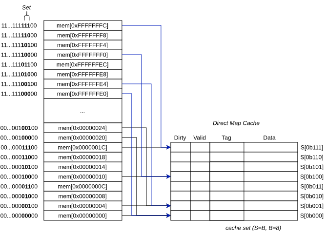
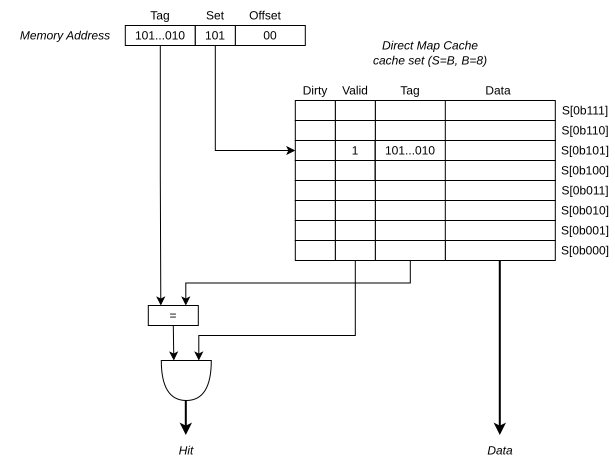
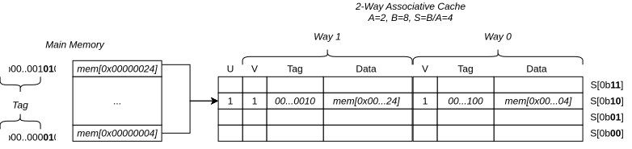

# Cache Terms
* `cache` memory that holds commonly or most recently used memory data.
* `cache block` group of words that is a unit of storage, also known as `cache line`.
* `b` *block size* size of a cache block.
* `C` *capacity* the number of data words that cache can hold.
* `B` which is `= C/b` is the number of cache blocks.
* `S` *sets*, cache is organized in terms of sets.
* `A` *Associativity*, is the degree of associativity of a *set associative cache*. 

# Direct Map Cache
In a *direct map* cache, each *Set*(`S`) has exactly one *Block*(`B`), `S=B`, which means in direct map cache, the **number of sets `S` is equal to the number of blocks `B`**. Lets create an example:



The `set` bits indicates the index of the cache line the data will be stored to. The most significant bit, the`tag` bits indicates the address in memory the data is located in. The `tag` and `set` associates cache data to the actual memory location data is stored into.



The problem with direct map cache is two or more `tag` could be associated into a single cache line. This is called *cache conflict*. Consider this code:
```C
int *a = 0x40;
int *b = 0x80;
int *c = 0xC0;
int size = 10;

while(size--)
  *c = *a++ + *b++;
```
if `0x40`, `0x80`, `0xC0` maps to the same set, both read and write access will repeatedly cause a cache miss. Every access will cause cache to be replaced. This problem is called *cache thrashing*.

# Cache Associativity
In a *set associative cache*, each set `S` would contain `B/A` blocks where `A` is the degree of associativity. An `A=2` means a cache with `B=8` would contains `B/A = 8/2 = 4` number of *sets* `S`.



**ARM always uses *set associative cache***. The `CCSIDR`(Cache Size ID Registers) provide information to cache.

```text
  31   30   29   28  27                    13 12             3 2          0
+----+----+----+----+------------------------+----------------+------------+
| WT | WB | RA | WA |         NumSets        |  Associativity |  LineSize  |
+----+----+----+----+------------------------+----------------+------------+
```
Fields Descriptions are:
  * `LineSize, bits[2:0]` is Log2(N) - 4, where *N=Number of Cache Line Bytes*.
  * `Associativity, bits[12:3]` *=Associative(`A`)-1* Is the degree of associativity for a *set associative* cache.
  * `NumSets, bits[27:13]` *=Number of Sets(`NSETS`)-1* The number of sets in the cache.
  * `WT, bit [31]` Indicates whether the cache level supports write-through.
  * `WB, bit [30]` Indicates whether the cache level supports write-back.
  * `RA, bit [29]` Indicates whether the cache level supports read-allocation.
  * `WA, bit [28]` Indicates whether the cache level supports write-allocation.

Example assembly code:
```asm
  mrc p15, 1, r1, c0, c0, 0 ; r1 = CCSIDR
  ldr r2, =0x07
  and r2, r2, r1            ; r2 = CCSIDR.LineSize
  ldr r3, =0x3FF
  and r3, r3, r1            ; r3 = CCSIDR.Associativity
  ldr r4, =0x7FFF
  and r4, r4, r1            ; r4 = CCSIDR.NumSets
```

Example C code:
```C
#define mrc(cp, opc1, val, crn, crm, opc2) \
	do { \
		uint32_t _val; \
		__asm__ volatile("mrc p" #cp ", " #opc1 ", %0, c" #crn ", c" #crm ", " #opc2 \
				 : "=r"(_val) \
				 : \
				 : "memory"); \
		(val) = _val; \
	} while (0)

uint32_t ccsidr = mrc(15, 1, 0 ,0, 0);
```


# Cache Policy

## Write Cache Policy
  * `write-through`: When data is written to cache, it is immediately written to memory. This keeps the cache and main memory sync but at the cost of increase in main memory traffic due to write transactions.
  * `write-back`: Writes are only performed in cache. This could cause data in memory to be **stale**. When cache is written , a **dirty** bit in cache is set to `1` to indicate that data is written in cache but not yet in main memory.

## Allocation Policy
  * *read-allocatation* policy indicates that at cache miss at *read*, *cacheline* will be filled by copying data from main memory, but cache miss at *write* will not fill the *cacheline*.
  * *write-allocatation* policy indicates that at cache miss at both *write* and *read*, *cacheline* will be filled by copying data from main memory. Note that this must be in combination with *write-back* policy, wherein the data written to a cache block is simultaneously written to main memory.

# Clean and Invalidation
  * `invalidation` refers to cache line **valid** bit to be set to `0`. If its valid, then invalidate!
  * `clean` refers to write contents of all cache lines with **dirty** bits set to main memory.

# PIPT and VIPT

> [!Note] ARM core main cache (L1) always use N-way set associative cache. 
> ``` text 
> Associative cache address format:
>  +----------------+--------+---------+----------+
>  |     Tag        |   Set  |   Word  |   Byte   |
>  +----------------+--------+---------+----------+
> 31              13 12     5 4       2 1         0
> ```

**Virtual Index Physical Tag**, means that *virtual address is used to determine the cache line index* but the *physical address is used for tag*. This resolves the issue of cache need for invalidation when MMU virtual to physical mapping changes. However this introduces new problem, since the associative cache uses bit [12:5] to determine the `set`, virtual address uses bit [12] for address translation (64KiB page size). This potentially creates a problem, two or more virtual address with different bit [13:12] could also point to the same physical address. This creates two or more cache entries that points to the same physical address, which means memory can already exist in the cache line with different virtual cache line index.
```text
                                  Virtual Address
 +----------------+-----------------------------+
 |      Index     |           offset            |
 +----------------+-----------------------------+
31       |      12 11          |                0
         v                     |
 +----------------+            |
 |   Translation  |            |
 +----------------+            |
         |                     |
         v                     v  Physical Address
 +----------------+-----------------------------+
 |      Index     |           offset            |
 +----------------+-----------------------------+
31              12 11                           0
```
The solution to this is to use [page colouring](https://developer.arm.com/community/arm-community-blogs/b/architectures-and-processors-blog/posts/page-colouring-on-armv6-and-a-bit-on-armv7) scheme. Page colouring uses `bits[13:12]` to indicate a colour. A page allocator, when mapping virtual address to a physical address, will impose restriction, to ensure that a physical address will only be mapped to a single colour. physical address will be use both as cache line index and cache tag. This ensures that there would be no duplicate physical address tag in cache.

All ARM cortex uses `PIPT` scheme for data cache and `VIPT` for instruction cache since usually, restriction in size can be imposed in instructions, which prevents wrapping of `bits[13:12]` which prevents having two virtual address being mapped to the same physical address.

