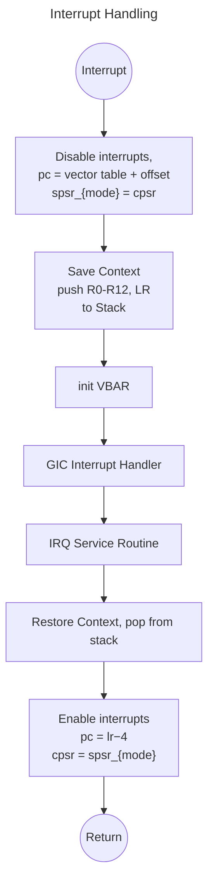
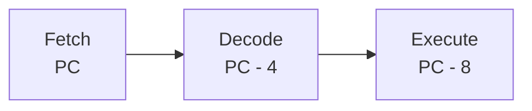

# Interrupt Handling



# Link Register Exception State
The table below indicates the return addresses after handling the exception.

| Exception | Address | Use |
| - | - | - |
| Reset | — | lr is not defined on a Reset |
|Data Abort | lr − 8 | points to the instruction that caused the Data Abort exception |
|FIQ | lr − 4 | return address from the FIQ handler |
|IRQ | lr − 4 | return address from the IRQ handler |
|Prefetch Abort | lr − 4 | points to the instruction that caused the Prefetch Abort exception |
|SWI | lr | points to the next instruction after the SWI instruction |
|Undefined Instruction | lr | points to the next instruction after the undefined instruction |

To understand this, we have to review the ARM 3-stage pipeline. ARM 3-stage pipeline is Fetch-Decode-Execute. Take a look into the image below

The latest `PC` value is the location of the instruction to fetch, and the oldest is the instruction being executed. Because of this, it reduce the latency of fetching the instruction and decoding since once the current executing instruction is finished, the next instruction is already decoded.

When an exception occurs, the current `PC` will be stored in *Link Register* `LR`, instruction execution is atomic and the CPU will finish it first before handling the interrupt and jump to the exception vector address. Therefore if the current `PC` points to instruction being fetched, the return address must be the instruction that is pending to be executed which is the *decoded* instruction. In the pipeline, that is `PC - 4`. So for interrupt handling, when returning, the `PC` must be set to `LR - 4`.

# Putting it all together
When an interrupt exception occurs, the program will jump to `irq_handler` from the vector table 
```asm
_reset:
  b reset_handler
  b undefined_handler
  b swi_handler
  b prefetch_handler
  b data_handler
  nop
  b irq_handler
  b fiq_handler
```
simultaneously, the CPU state `CPSR` will be stored in `SPSR_{mode}` in this case, the current mode is IRQ, the previous `CPSR` will be stored to `SPSR_IRQ` (every mode has its own banked `SPSR` register). The `SPSR_IRQ` will be used to restore the `CPSR` once the program exit from interrupt routine. Once inside `irq_handler`, save the `AACPS` register states, 

```asm
  stmdb sp!, {r0-r3, r12, lr} /* save state to stack */
  b .
  ldmia sp!, {r0-r3, r12, lr} /* save state to stack */
  subs pc, lr, #4             /* yield execution back to pc - 4 */
```

What happens `subs pc, lr, #4`? `subs PC, LR, #imm`  is a special instruction. It provides an exception return without the use of the stack. It loads `pc` with value `lr - imm` which causes branching to `lr - imm` simultaneously restoring `CPSR` from `SPSR_{mode}`.

> [!NOTE] AACPS Registers
> `AAPCS` (*Arm Architecture Procedure Call Standard*) is the convention that lets separately compiled functions call each other consistently. It defines how registers are used across a function call. *Therefore, it has to be saved and restored, since interrupt could happen while normal functions are executing*.
>  
>| Registers      | Typical role |
>| -------------- | ------------ |
>| r0–r3          | Function arguments and return values; caller-saved |
>| r4–r8, r10–r11 | Callee-saved: a function must preserve them if it uses them |
>| r9             | Platform-specific role; may be callee-saved |
>| r12 (ip)       | Scratch register; caller-saved |
>| r13 (sp)       | Stack pointer |
>| r14 (lr)       | Link register, holds the return address |
>| r15 (pc)       | Program counter |
